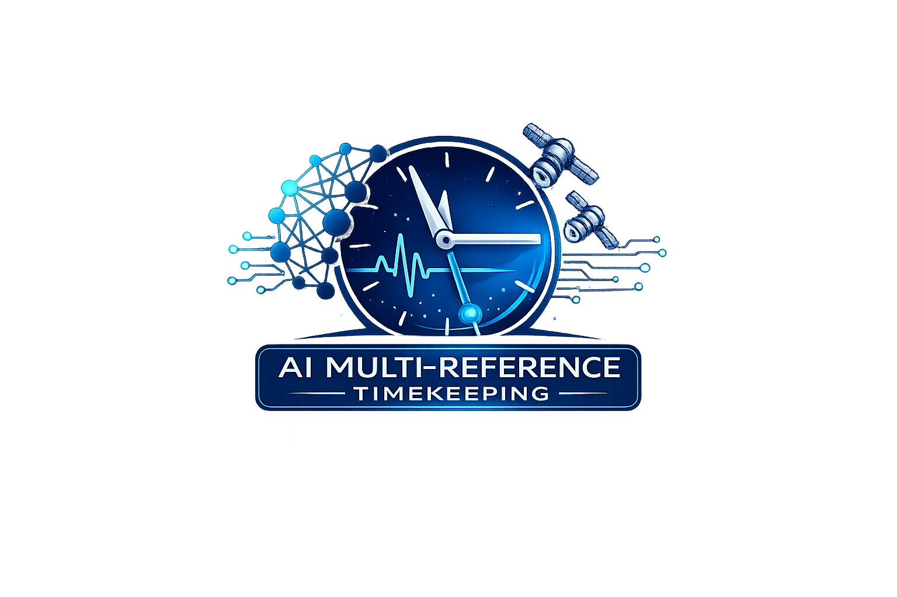

# 🕒 ai-multi-reference-timekeeping
**AI-Assisted Multi-Reference Timekeeping for Commodity Networks**

<p align="center">
  <a href="https://github.com/infinityabundance/ai-multi-reference-timekeeping">
    
  </a>
</p>

[](LICENSE)
[](https://zenodo.org/)
[](https://colab.research.google.com/)
[](https://standards.ieee.org/standard/1588-2008.html)

This repository contains the reference implementation and reproducibility artifacts for the paper:

**_An AI-Assisted Multi-Reference Timekeeping Architecture for Commodity Networks_**  
👤 Riaan de Beer  
📄 Zenodo DOI: [https://zenodo.org/records/18366358](https://zenodo.org/records/18366358)

This project explores a low-cost, AI-assisted approach to time synchronization that synthesizes a **virtual master clock** from multiple imperfect timing references (e.g., GNSS 🌍, PTP 🔗, NTP 🌐) using classical estimation techniques augmented with lightweight machine learning 🤖.

The goal is to improve **practical packet-level synchronization** on commodity hardware — without requiring atomic clocks ⚛️ or specialized time cards.

---

---

## 🔬 Scientific Foundation

This project is grounded in **Relativistic Temporal Logic** and **Distributed Systems Theory**. We move beyond standard linear timekeeping to provide a multi-reference framework designed for the next generation of AI agents.

* **Theory & Proofs:** For a deep dive into the mathematical transforms, dilation matrices, and causal manifolds, please see:
    👉 **[RESEARCH.md](./RESEARCH.md)** 📑

* **Academic Citation:** If you are using this framework for peer-reviewed research, please refer to the [Citation section](#-citation) below.


---
> ### 📖 Research Deep-Dive
> We have formalized the mechanics of **Computational Dilation** and **Temporal Anchoring**. 
> To explore the underlying physics and math of this implementation, check out our **[Research Paper Summary](./RESEARCH.md)**.
---

## 📐 Theoretical Foundation

This project formalizes timekeeping by treating temporal progression as a relativistic coordinate system. Instead of a single linear clock, we define a **Temporal State Vector** where time is mapped across multiple reference frames.

### 1. The Reference Frame Model
Each reference frame $F_i$ (e.g., an AI agent's internal simulation clock) is defined relative to the Master Reference Frame ($M$) by the tuple:

$$F_i = (t_{0,i}, \phi_i, \chi_i)$$

Where:
- $t_{0,i}$: The **Temporal Anchor** (epoch offset).
- $\phi_i$: The **Dilation Factor** (relative clock speed).
- $\chi_i(t)$: The **Drift Function** (stochastic or systemic error).


### 2. Forward Transform
To map Master Time ($T_M$) to a specific Local Reference ($t_i$), we apply the following transform:

$$t_i = \phi_i (T_M - t_{0,i}) + \chi_i(T_M)$$

### 3. Inter-Frame Transformation
To translate directly between two non-master frames (Frame $A$ and Frame $B$) without intermediary calculation, we use the composed transform:

$$t_B = \frac{\phi_B}{\phi_A} t_A + \phi_B(t_{0,A} - t_{0,B})$$

This allows the system to determine the **Relative Temporal Velocity** ($\frac{\phi_B}{\phi_A}$) between two disparate AI contexts.


### 4. Dynamic Time Warping (Non-Linear Dilation)
In scenarios where processing speed varies (e.g., high-inference loads or hardware throttling), $\phi$ becomes a time-dependent function $\phi(t)$. The local time is then derived via integration:

$$t_i = \int_{t_{0,i}}^{T_M} \phi_i(\tau) \, d\tau$$

---

## 🎯 Motivation

High-precision time synchronization is increasingly important for distributed systems, including:

- ⏱️ Time-sensitive networking (TSN)
- 💾 Coordinated I/O and storage pipelines
- 📦 Packet scheduling and timestamping
- 🧪 Experimental distributed systems research

Commercial solutions typically rely on **atomic oscillators and dedicated PCIe time cards**, which remain costly and inaccessible to many researchers and open-source projects.

This work investigates whether **intelligent multi-reference fusion**, combined with lightweight local learning, can narrow the gap for practical synchronization tasks using commodity hardware.

---

## 🧠 What This Project Does

- 🔀 Fuses multiple heterogeneous timing references into a **single virtual clock**
- 📐 Combines a **state-space clock model** with a **lightweight neural network**
- 📊 Adapts reference weighting based on observed jitter, stability, and context
- 🔌 Exposes time via standard mechanisms (PTP, PHC, NTP)
- ♻️ Targets reproducibility using open-source tools and Google Colab notebooks

---

## 🛰️ Time Server Scaffold (Sensors + AI Weighting)

The repository now includes a **time server scaffold** in `src/ai_multi_reference_timekeeping/time_server.py`
that lets you:

- 🧩 Plug in sensor inputs (temperature, humidity, pressure, AC hum, SDR SNR, Geiger CPM, audio activity)
- 📡 Collect references over NTP, GPS NMEA, or the hardware RTC (via `hwclock`)
- 🔌 Listen from GPIO/USB/serial by wiring sensors with `GpioPulseSensor`, `SerialLineSensor`, or `open_line_source`
- 🧠 Adjust reference variance using a lightweight inference model
- 📉 Estimate drift and slew from recent offsets

Example usage:

```python
from ai_multi_reference_timekeeping.fusion import ReferenceFusion, VirtualClock
from ai_multi_reference_timekeeping.kalman import ClockCovariance, ClockKalmanFilter, ClockState
from ai_multi_reference_timekeeping.time_server import (
    LightweightInferenceModel,
    NtpReference,
    SensorAggregator,
    TimeServer,
)

kalman = ClockKalmanFilter(
    state=ClockState(offset=0.0, drift=0.0),
    covariance=ClockCovariance(p00=1.0, p01=0.0, p10=0.0, p11=1.0),
    process_noise_offset=1e-4,
    process_noise_drift=1e-6,
)
clock = VirtualClock(kalman_filter=kalman, fusion=ReferenceFusion())

class EnvSensor:
    def sample(self) -> dict[str, float]:
        return {"temperature_c": 27.0, "humidity_pct": 40.0}

server = TimeServer(
    clock=clock,
    references=[NtpReference(name="nist")],
    sensors=SensorAggregator(EnvSensor()),
    inference=LightweightInferenceModel(),
)

update, frame, drift_estimate, drift_hint = server.step(dt=1.0)
print(update.fused_offset, drift_estimate.drift, drift_hint)
```

---

## 🚫 Non-goals

This project explicitly does **not** aim to:

- ❌ Replace atomic clocks or high-stability oscillators
- ❌ Provide nanosecond-level absolute UTC accuracy under all conditions
- ❌ Serve as a primary time standard
- ❌ Offer cryptographic guarantees against fully adversarial time manipulation

The system prioritizes **robustness, accessibility, and cost-effectiveness** for packet-level synchronization in experimental and operational environments.

---

## 🗂️ Repository Structure

    ai-multi-reference-timekeeping/
    ├── paper/              # 📄 LaTeX source and figures for the paper
    ├── notebooks/          # 📓 Google Colab–friendly notebooks
    ├── src/                # 🧩 Fusion, ML, and evaluation code
    ├── data/               # 🗃️ Example and processed datasets
    ├── models/             # 🧠 Trained and baseline models
    ├── configs/            # ⚙️ Configuration files
    ├── scripts/            # 🛠️ CLI utilities
    ├── reproducibility/    # 🔁 Experimental protocols and hardware notes
    ├── environment/        # 📦 Dependency specifications
    ├── LICENSE
    └── README.md

---

## ☁️ Google Colab Reproducibility

The notebooks in `notebooks/` are designed to run directly in **Google Colab** — no specialized hardware required.

🔰 **Recommended entry point**:
- `notebooks/00_overview.ipynb` — overview of the architecture and experiments  
  [](https://colab.research.google.com/github/your-org/ai-multi-reference-timekeeping/blob/main/notebooks/00_overview.ipynb)

✅ **Notebook test runs**:
- `notebooks/10_test_fusion.ipynb` — validates fusion and quality weighting  
  [](https://colab.research.google.com/github/your-org/ai-multi-reference-timekeeping/blob/main/notebooks/10_test_fusion.ipynb)
- `notebooks/11_test_time_server.ipynb` — validates time server + ML variance model  
  [](https://colab.research.google.com/github/your-org/ai-multi-reference-timekeeping/blob/main/notebooks/11_test_time_server.ipynb)

Each notebook includes an **Open in Colab** link and installs dependencies automatically.

---

## 📈 Evaluation Metrics

The evaluation framework focuses on standard timing metrics, including:

- ⏲️ Time Deviation (TDEV)
- 📏 Maximum Time Interval Error (MTIE)
- 🔄 PTP offset stability
- 🕰️ Holdover behavior during reference loss

Absolute UTC ground truth is not required for most experiments.

---

## 🔐 Security and Threat Model

The system is designed to tolerate noisy, intermittent, and partially unreliable timing sources.  
It does **not** assume a fully adversarial environment.

Considered threats include:

- 📡 GNSS degradation, multipath, and interference
- 🔀 Network-induced delay asymmetry
- ⚠️ Transient reference instability

Coordinated compromise of all timing references is considered out of scope.

---

## 📜 License

This project is licensed under the **Apache License 2.0**.

See the [LICENSE](LICENSE) file for details.

---

## 📚 Citation

If you use this work, please cite:

    @misc{debeer2026aimrt,
      title  = {An AI-Assisted Multi-Reference Timekeeping Architecture for Commodity Networks},
      author = {de Beer, Riaan},
      year   = {2026},
      doi    = {10.5281/zenodo.XXXXXXX}
    }

---

## 🚧 Status

This repository accompanies a research paper and is intended to evolve.  
Contributions, discussion, and replication studies are welcome 🤝.

---

## 🙏 Acknowledgments

This work builds on established research in time metrology, clock ensembles,
and IEEE 1588 Precision Time Protocol, and aims to make these ideas more
accessible to open-source and experimental systems communities.

